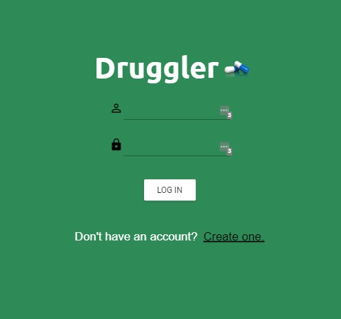

# Druggler

**Description**

Druggler is a web based application that allows users to track when they need to take their medications, as well as allowing users to search for interactions between different drugs. Users are able to sign up and create a unique profile that allows the user to add, edit and delete prescription drugs from their pill tracker dashboard.

**User Story**

Given that I am someone who takes prescription drugs on a regular basis, I want to be able to track those medications and when I need to take them. I also want to be able to see the types of interactions that can occur between different medications.

**Build status**

The build status is complete.

**Code style**

Drugglers is a MERN application using MongoDB, Express, React and Node.js. Our database uses two collections to establish an association between a user’s profile and the drugs they have added to their pill tracker dashboard. For UI, our team used the Material-UI library to speed up component building.

**Code example**

```javascript
//all tracker related functions

const getDrugTime = async (drugData) => {
  const drugT = await drugData.map((drug) => ({
    id: drug._id,
    combinedTime: `${drug.lastTakenDate} ${drug.lastTakenTime}`,
    frequency: parseInt(drug.frequency),
  }));
  console.log(drugT);
  const allFutureDrug = await drugT.map((drug) => ({
    id: drug.id,
    prediction: futureTimeCalcuation(drug.combinedTime, drug.frequency),
  }));
  return allFutureDrug;
};
const compareTime = async (drugData) => {
  const currentTime = moment().format("YYYY-MM-DD hh:mm a");
  let myFutureTime = await getDrugTime(drugData);
  console.log("Current time: ", currentTime);
  console.log(myFutureTime);
  let drugQuarter = await myFutureTime.map((drug) => {
    let quarterOneMet = moment(currentTime).isBefore(drug.prediction[0]);
    let quarterTwoMet = moment(currentTime).isBetween(
      drug.prediction[0],
      drug.prediction[1],
      "minutes",
      "[)"
    );
    let quarterThreeMet = moment(currentTime).isBetween(
      drug.prediction[1],
      drug.prediction[2],
      "minutes",
      "[)"
    );
    let quarterFourMet = moment(currentTime).isBetween(
      drug.prediction[2],
      drug.prediction[3],
      "minutes",
      "[)"
    );
    let timesUp = moment(currentTime).isBetween(
      drug.prediction[3],
      currentTime,
      "minutes",
      "[]"
    );
    console.log(drug.id);
    console.log("Quarter 1 Met: ", quarterOneMet);
    console.log("Quarter 2 Met: ", quarterTwoMet);
    console.log("Quarter 3 Met: ", quarterThreeMet);
    console.log("Quarter 4 Met: ", quarterFourMet);

    if (quarterOneMet) {
      return "quarterOne";
    } else if (quarterTwoMet) {
      return "quarterTwo";
    } else if (quarterThreeMet) {
      return "quarterThree";
    } else if (quarterFourMet) {
      return "quarterFour";
    } else if (timesUp) {
      return "eatNow";
    }
  });
  return drugQuarter;
};
const updatingallDrugs = async (drugsData) => {
  let finalDrugs = [];
  await compareTime(drugsData)
    .then((res) => {
      finalDrugs = drugsData.map((drug, index) => ({
        ...drug,
        currentQuarter: res[index],
      }));
    })
    .catch((err) => console.log(err));
  console.log("FINALLLLL: ", finalDrugs);
  return finalDrugs;
};
```

**Screenshots**




**Installation**

No installation necessary. Project is hosted here: https://druggler.herokuapp.com/ GitHub repo: https://github.com/mattchley/DrugBud

**Future development**

There is additional functionality we identified for future development. For instance, the ability to rank pills in order of when they should be taken with a real-time timer, not just by color coding. Adding auto-type functionality to help users find and spell their pills correctly. Allowing users to set their drugs after searching for interactions. Implementing PWA.

**Credits**

Mark Berntein (Github: Mark-Bernstein)
Jocelyn Chang (Github: jocelync1094)
Matt Atchley(Github: mattchley)
Chris Underwood (Github: uchrisd)
